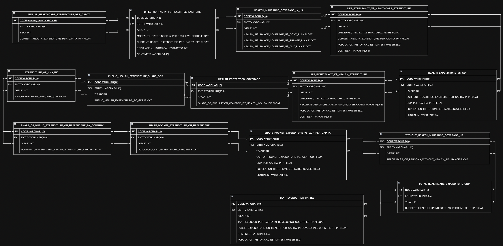

# Financing-Healthcare-Data-Project

Welcome to my Financing Healthcare Data Engineering Project! This is a project I pursued to demonstrate skills with key tools, technologies, and concepts related to data and analytics engineering. See [table of contents](#table-of-contents ) below to navigate.

### Full Data Pipeline Architecture

## Table of Contents

#### 1. About the Dataset
#### 2. Technologies Used
#### 3. ETL Processes and Data Modeling
#### 4. Performance and Optimization
#### 5. Testing and Data Quality
#### 6. Future Improvements

------------------------------------

### Financing Healthcare ERD of Raw Tables

